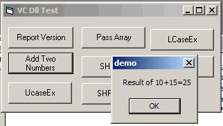



## Writeing A DLL with VC for VB Project \+ Tutor

### Description

hi this was a Project I made a while back showing to to use a VC DLL within VB anyway I never submited it. well today I found it on my harddrive. and desided to submit it. but also adding a 6 pages Word Document showing step by step on how to make one.

Hope you like it
 
### More Info
 

             |
---                |---
**Submitted On**   |2005-05-06 09:27:14
**By**             |[dreamvb](https://github.com/Planet-Source-Code/PSCIndex/blob/master/ByAuthor/dreamvb.md)
**Level**          |Beginner
**User Rating**    |5.0 (10 globes from 2 users)
**Compatibility**  |VB 6\.0
**Category**       |[Complete Applications](https://github.com/Planet-Source-Code/PSCIndex/blob/master/ByCategory/complete-applications__1-27.md)
**World**          |[Visual Basic](https://github.com/Planet-Source-Code/PSCIndex/blob/master/ByWorld/visual-basic.md)
**Archive File**   |[Writeing\_A188537562005\.zip](https://github.com/Planet-Source-Code/dreamvb-writeing-a-dll-with-vc-for-vb-project-tutor__1-60396/archive/master.zip)

